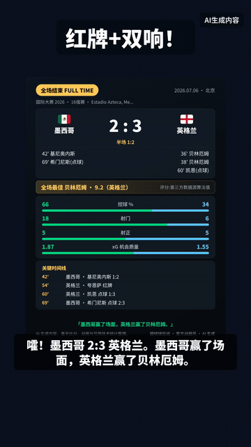
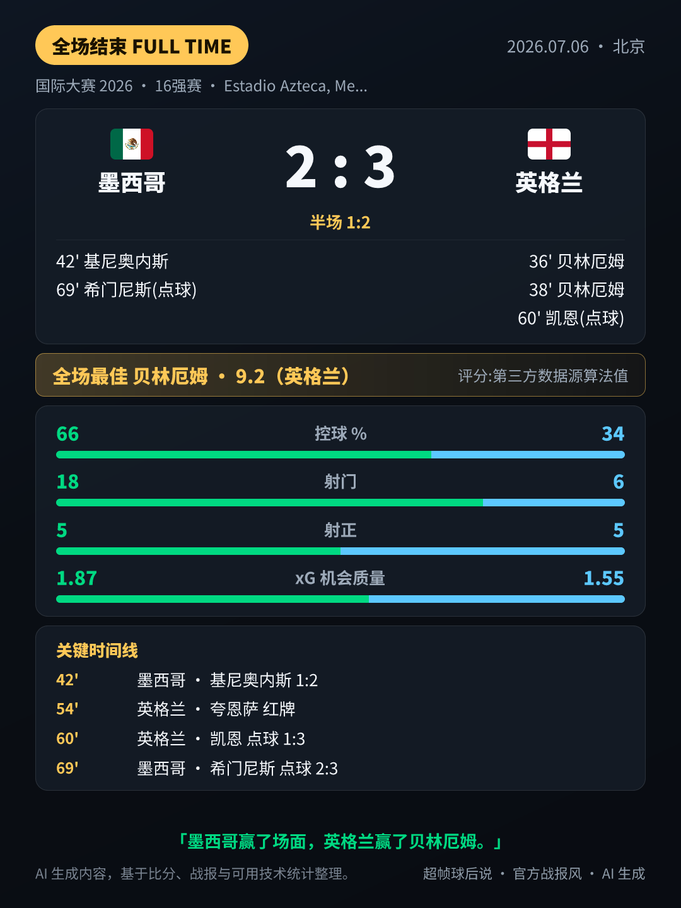

<div align="center">

# ⚽ 球后说 · qiuhoushuo

**赛后 2 分钟,AI 把这场球给你聊透**

三口味战报 · 一图看懂 · 数据榜单 · AI 赛后口播视频 —— 每场比赛完赛后全自动生产



*↑ 完赛后全自动生成的「老李赛后说」竖版视频:顶部大标题钩子 + 官方战报卡 + 老李嗓音旁白 + 字幕,适配抖音安全区版式*

</div>

## 📲 立即体验

<table>
<tr>
<td width="240" align="center">
<br/>
<b>微信扫码直达小程序</b>
</td>
<td>

| 渠道 | 入口 |
|---|---|
| 🟢 微信小程序 | 扫左侧小程序码,或微信搜「**超帧球后说**」 |
| 💬 微信服务号 | 微信搜「**球后说**」——每场战报图文自动推送 |
| 📕 小红书 | 搜「**球后~会看球的女孩**」——战报笔记 + 金靴赛道追更 |
| 🌐 网页版 | [qiuhoushuo.com](https://qiuhoushuo.com) |

</td>
</tr>
</table>

## ✨ 功能一览

- **⚡ 三口味 AI 战报**:硬核战术版 / 情感故事版 / 段子脱口秀版,完赛后自动生成,总有一款对你胃口
- **🧠 一图看懂**:比分进程、胜负关键、数据证据、关键时间线,一张卡把整场球讲明白(看球小白友好)
- **📊 数据卡矩阵**:球员评分卡(全场最佳)、射手榜 / 助攻榜、小组积分榜、淘汰赛对阵图,全中文球员名 + 队旗
- **🎬 AI 赛后口播视频**:虚构解说「老李」嗓音口播赛后解说,顶部大标题钩子 + 官方战报卡 + 字幕(大模型 TTS + ffmpeg 合成,适配抖音安全区版式)
- **🖼️ 球迷形象 & 球星合影**:上传一张自拍,生成支持球队主题的球迷形象,或和球星「同框」合影(见下方展示)
- **🔔 比赛提醒**:开赛前 + 战报就绪双订阅消息,不错过任何一场

## 🖼️ AI 玩法展示

| 我的球迷形象(支持球队主题) | 和球星「同框」合影 |
|:---:|:---:|
|  |  |

> 以上均为 AI 生成的虚构形象(画面带「AI生成」显著标识),非真实人物合影;生成结果恒带水印与披露文案,自拍原图内存处理不落盘。

## 🎬 视频管线长这样

| 官方战报风数据卡(主画面素材) | 合成成片:顶部钩子 + 数据卡 + 字幕 |
|:---:|:---:|
|  |  |

流水线:战报数据 → 口播脚本(过滤词表+仅赛后事实)→ 大模型 TTS 真声 → ffmpeg 合成(顶部大标题钩子 + 官方战报卡 + 烧字幕 + 「AI生成内容」常驻水印,画面避开抖音平台 UI 安全区)→ 人工过审后发布。

## 🏗️ 项目组成

- **web/** — Next.js 15 服务端:战报生成(LLM 双供应商容灾)、卡片渲染(satori→PNG)、榜单/积分/对阵数据(API-Football)、AI 赛后口播视频管线(火山 TTS + ffmpeg 合成)、订阅消息、支付(微信 JSAPI)
- **miniprogram/** — 微信小程序客户端(原生,零依赖)
- **packages/share-cards/** — 分享卡渲染库(三风格 × 三平台,NotoSansSC 字体安全转写防豆腐块)
- **e2e/** — Playwright 端到端

## 🚀 快速开始

```bash
pnpm install
pnpm --filter @qhs/share-cards build   # workspace 包产物(dist 不入库)
cp web/.env.example web/.env.local     # 按下表填入所需凭证
pnpm -C web dev
```

| 配置分组 | 关键变量 | 用途 |
|---|---|---|
| LLM(必填) | `DOUBAO_API_KEY` / `DEEPSEEK_API_KEY` | 战报生成,双供应商互为容灾 |
| 赛事数据(必填) | `API_FOOTBALL_KEY` | 比分 / 事件 / 技术统计 / 榜单 |
| 数据库 | `SUPABASE_URL` / `SUPABASE_SERVICE_ROLE_KEY` | 或用 `docker-compose.yml` 自建 PostgREST |
| 对象存储 | `COS_*` | 卡片 / 视频产物落盘与分发 |
| 微信生态(可选) | `WX_APPID` / `WX_SECRET` / `WXPAY_*` | 小程序登录、订阅消息、支付 |
| 视频管线(可选) | `VOLC_TTS_*` / `DOUBAO_VIDEO_*` / `LAOLI_*` | 老李赛后口播视频;费用闸默认关 |

全量变量逐项注释见 `web/.env.example`。完整测试:`pnpm run ci`(小程序 + web 全量 + 构建 + 静态检查)。

## 🛡️ 合规内建

AIGC 显著标识(像素层烧入,无开关)、生成内容审核、隐私同意门(未同意零采集)、未成年人保护、人脸原图不落盘——全部在代码层内建,不依赖运营自觉。

## License

MIT(见 LICENSE)。本仓库为代码快照,不含开发历史与内部运营文档。
